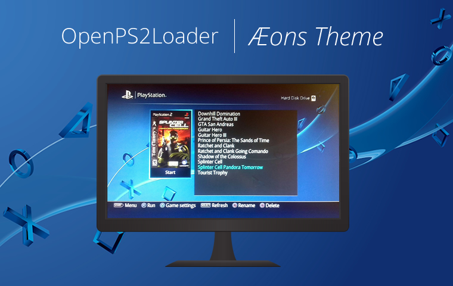

OPL Æons Theme
================

<br>
<p align="center">
  
</p>
<br>


An OpenPS2Loader theme inspired by the PS4 Dashboard. This theme is based on Jay-Jay's Themes. It has support for cover images and background, also providing an ELM (PSone games) page with square game covers.

> **NOTE**: This theme does NOT have support for info page. Maybe sometime in the future it will be added.

## Installation:

* You are provided with two themes: **thm_opl_aeons** (4:3 theme) and **thm_opl_aeons_widescreen** (16:9 theme) (for widescreen TV's). 
* Copy the themes on the THM folder of your OPL folder structure. If you are not familiar with adding custom themes to OPL, then follow [this](http://www.ps2-home.com/forum/viewtopic.php?f=51&t=3467) guide.
* Start OPL, and in ```Settings -> Display Settings -> Theme``` select:
    - **thm_opl_aeons**: if your TV is 4:3
    - **thm_opl_aeons_widescreen**: if your TV is 16:9
* Now in ```Settings -> Display Setings -> Widescreen``` select **On** if you are using the **thm_opl_widescreen** theme.

> **NOTE**: Remember to enable the **Enable Cover Art** option in ```Settings```, and disable the **Display Info Page** (this one because the theme does not support Info Page yet)


